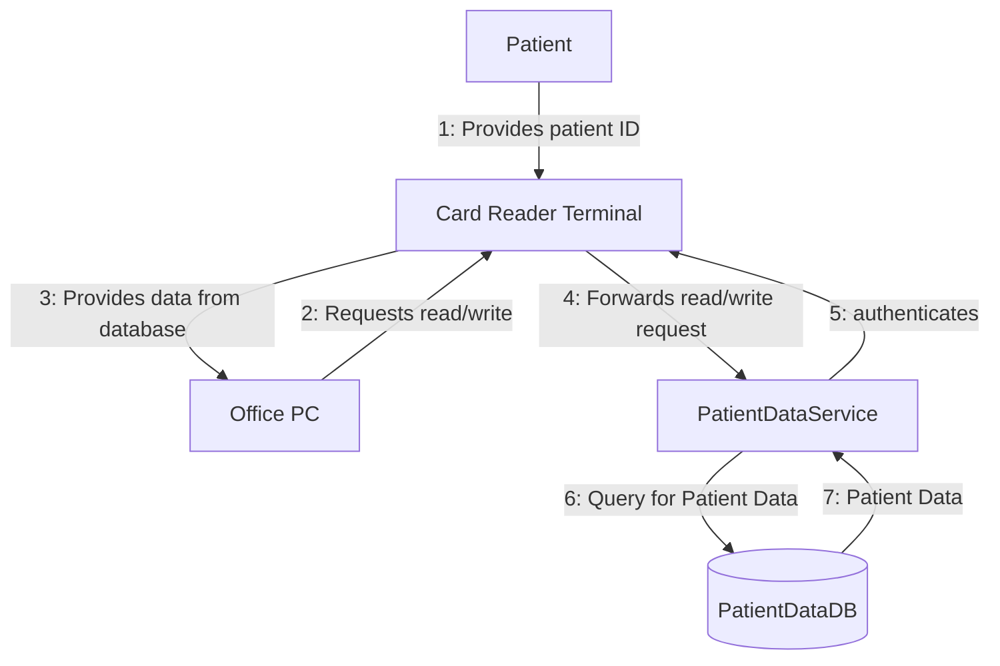

# Phase 2: Threat Modeling & Risk Analysis (~30 pts)

**Lectures:** lect-11, lect-09
**Time budget:** ~2.5 hours
**Exam payoff:** Threat Modeling (22 pts), Protection Poker (8 pts)

---

## 1. XSS — Cross-Site Scripting (CWE-79)

> **NOT ASKED as its own section on past exam** — but XSS appears in the Defensive Coding code snippet (Snippet 1 is an XSS vulnerability). Know the types and mitigation cold.

### What it is

Attacker injects code (HTML/JavaScript) into dynamic web content that executes in the victim's browser.

### Three types

| Type                  | How it works                                                   | Example                                |
| --------------------- | -------------------------------------------------------------- | -------------------------------------- |
| **Reflective**        | Injected input sent back to client via GET parameters in a URL | `?name=<script>alert('Pwnd')</script>` |
| **Persistent/Stored** | Injected input stored on server, delivered in future requests  | Guest books, user profiles             |
| **DOM-based/Local**   | Exploit executed on client machine, no server interaction      | Malicious browser plugin               |

### How it works

```
1. Server takes user input and echoes it into HTML without sanitization
2. Attacker crafts input: <script>alert('Pwnd')</script>
3. Server generates: <pre>Hello <script>alert('Pwnd')</script></pre>
4. Browser executes the JavaScript
```

### Mitigation

**Escape "bad" characters via built-in functions (NOT self-made regex):**

```php
$name = htmlspecialchars($_GET['name']);
echo "<pre>Hello ${name}</pre>";
```

### Real-world example

- **Twitter XSS worm (2010):** `onmouseover` event handler not sanitized. Self-propagating worm spread across thousands of accounts.

### CIA Impact

- **Confidentiality:** Session cookies stolen, authentication tokens exposed
- **Integrity:** Unauthorized actions (tweets, posts) on behalf of user
- **Availability:** Platform trust degraded during incident

---

## 2. Architectural Risk Analysis

> **NOT ASKED as a standalone definition question on past exam** — but this is the framework that the entire Threat Modeling section (22 pts) is built on. Know the approach.

### Definition

A structured, repeatable approach to identify potential security flaws in software or systems **at design time**.

### Key points

- **Teamwork** — risk analysis is collaborative
- **Timing** — discuss security risk once most of the architecture is settled, but early enough to make changes
- **Focus** — emphasis on design flaws over code-level vulnerabilities
- **Motivation** — a few good early decisions go a long way (encryption placement, auth & access control, technology choices)
- **Cost** — detecting vulnerabilities early is 5-30x cheaper than finding them in production

### Questions to answer

- What are potential threats?
- What are my assets?
- Who would/can attack me?

---

## 3. Three Phases of Threat Modeling

> **ASKED ON EXAM** — Threat Modeling section (~2 pts): _"Please name the three phases of the general threat modeling approach. You don't need to describe them."_

### The three phases:

1. **Determine threats**
   - Identify entry/exit points
   - Identify trust boundaries
   - Identify threats

2. **Rate threats**
   - Identify most probable threats
   - Identify most critical threats

3. **Determine countermeasures**
   - Identify solutions to mitigate threats
   - Document non-mitigated threats

> **Partial credit:** Even just writing "1. Determine threats, 2. Rate threats, 3. Determine countermeasures" gets you the full points. No description needed.

---

## 4. Data Flow Diagram (DFD) Primitives

> **NOT ASKED as a definition question on past exam** — but you need to know these to read the SePA DFD and conduct STRIDE analysis. Foundation for the 22-pt section.

### Four DFD elements

| Symbol         | Element             | Description                          | Example                         |
| -------------- | ------------------- | ------------------------------------ | ------------------------------- |
| Rectangle      | **External Entity** | Clients, other systems, dependencies | Browser, Patient                |
| Circle/Rounded | **Process**         | Architecture-centered functionality  | Web Server, PatientDataService  |
| Parallel lines | **Data Store**      | Database, file system                | PatientDataDB                   |
| Arrow          | **Data Flow**       | Domain-specific data movement        | "Login Request", "Patient Data" |

### Naming tip (from lecture — "Naming is Huge")

- **Bad:** "HTTP", "Request", "server"
- **Good:** "Blog Content", "Patient Health Records", "feedly.com"
- Name trust boundaries descriptively: "External Partner API Boundary" not "Machine boundary"

---

## 5. Trust Boundaries

> **ASKED ON EXAM** — Threat Modeling section (~8 pts): _"Write down all trust boundaries you would define in this scenario by naming them and describing the corresponding edge numbers. Also, provide your reasoning for them briefly."_

### Definition

A trust boundary exists where data crosses from one party to another and **is not trusted**. Data crossing a trust boundary must be validated.

### When to draw a trust boundary

- **Untrusted:** Data from a web browser, data from one machine to another, data from external entities
- **Trusted:** Data from another process within the same runtime environment, data from the database (within same zone)

### Trust Boundaries for SePA (EXAM ANSWER FORMAT)

The SePA DFD has these edges:



**Trust Boundary 1: "Patient-Terminal Interface" (Edge 1)**
The patient's insurance card is an external entity outside our control. The card could be stolen, cloned, or contain manipulated data. All data from the patient card must be validated by the Card Reader Terminal.

**Trust Boundary 2: "Doctor's Office — External Network" (Edges 4, 5)**
Data crosses from the doctor's office network to the VPN/PatientDataService over an external network. Even though VPN provides encryption, the boundary exists because the doctor's office environment is less controlled than the DataProvider. Authentication and integrity checks are needed.

**Trust Boundary 3: "Office PC — Card Reader Terminal" (Edges 2, 3)**
The Office PC runs doctor's software that could be compromised (malware, insider threat). The Card Reader Terminal acts as a secure gateway and should not blindly trust requests from the Office PC. All requests must be validated and authenticated via the doctor's chip card.

**Trust Boundary 4: "PatientDataService — PatientDataDB" (Edges 6, 7)**
While both are within the DataProvider zone, defense in depth dictates that the database should only accept properly authorized queries from the service layer. This prevents direct database access if the service is compromised.

> **Clarification:** In this specific high-level DFD, **every edge crosses a trust boundary** because each component is in a different security zone or trust level (External Card, Untrusted PC, Trusted Terminal Hardware, Backend Service, Database). In more complex DFDs, internal edges within a single trust zone would not cross boundaries.

> **Scoring tip:** The naming + edge numbers + brief reasoning format is exactly what the exam asks. Even naming 2-3 boundaries with reasonable edge references gets you most of the points. Follow the example format the exam gives you.

---

## 6. STRIDE — Threat Categories

> **ASKED ON EXAM** — Threat Modeling section (~12 pts): _"Conduct a STRIDE per Element analysis for the external entity 'Patient' and name one threat for each element (if applicable)."_

### The six categories (MEMORIZE)

| Letter | Threat                 | Definition (prof's exact words)                                  | Security Property Violated       |
| ------ | ---------------------- | ---------------------------------------------------------------- | -------------------------------- |
| **S**  | Spoofing               | "Pretending to be something or someone other than yourself"      | Authentication                   |
| **T**  | Tampering              | "Modifying something on disk, on a network, or in memory"        | Integrity                        |
| **R**  | Repudiation            | "Claiming that you didn't do something, or were not responsible" | Non-repudiation / Accountability |
| **I**  | Information Disclosure | "Providing information to someone not authorized to see it"      | Confidentiality                  |
| **D**  | Denial of Service      | "Absorbing resources needed to provide service"                  | Availability                     |
| **E**  | Elevation of Privilege | "Allowing someone to do something they're not authorized to do"  | Authorization                    |

### STRIDE per Element — which threats apply to which DFD element

| Component           | S   | T   | R   | I   | D   | E   |
| ------------------- | --- | --- | --- | --- | --- | --- |
| **External Entity** | X   |     | X   |     |     |     |
| **Process**         | X   | X   | X   | X   | X   | X   |
| **Data Store**      |     | X   | X   | X   | X   |     |
| **Data Flow**       |     | X   |     | I   | X   |     |

> **This table is critical.** External entities can only be Spoofed or Repudiated. Processes are vulnerable to ALL six. Data stores can't be spoofed. Data flows can be tampered with or disclosed but not spoofed.

### STRIDE per Element for "Patient" (EXAM ANSWER FORMAT)

The Patient is an **External Entity**, so only S and R apply from the standard table. But you should address all six and explain why each is or isn't applicable:

- **S (Spoofing): Possible.** An attacker could steal or clone a patient's insurance card and pretend to be the patient. They would insert the stolen card into the Card Reader Terminal and gain access to the patient's medical records for 30 days.

- **T (Tampering): Not directly applicable.** The Patient is an external entity — we cannot control what the patient does with their own card. However, if the card data is transmitted without integrity checks, an attacker could tamper with the data in transit (this is more a data flow threat).

- **R (Repudiation): Possible.** A patient could deny having visited a doctor or deny that certain medical records were updated during their visit. Without proper logging and non-repudiation mechanisms (e.g., signed requests using the private key on the card), the patient could claim they never authorized an update.

- **I (Information Disclosure): Not directly applicable.** The Patient entity itself does not disclose information — information disclosure threats apply to the data flows or processes that handle the patient's data, not the external entity itself.

- **D (Denial of Service): Not directly applicable.** An external entity typically cannot be denied service itself in the STRIDE model. DoS threats apply to processes and data stores that the patient interacts with.

- **E (Elevation of Privilege): Not directly applicable.** External entities operate outside the system's privilege model. Elevation of privilege applies to processes within the system.

> **Scoring tip:** The exam gives ~12 pts for this. Even if you can't fully justify each category, stating "Possible, because..." or "Not applicable, because..." for each letter earns partial credit. Never leave a STRIDE category blank. Writing all 6 categories with brief reasoning gets you most of the points.

---

## 7. STRIDE per Element vs STRIDE per Interaction

> **NOT ASKED on past exam** — but know the distinction in case it's asked as a "name and describe" question.

| Aspect         | STRIDE per Element                                                       | STRIDE per Interaction                                              |
| -------------- | ------------------------------------------------------------------------ | ------------------------------------------------------------------- |
| **Applied to** | Each component individually                                              | Each interaction/data flow                                          |
| **Pros**       | Systematic coverage, independent analysis, relates threats to components | Focuses on real attack paths, less duplication, less time-consuming |
| **Cons**       | Time-consuming, misses interaction-level threats, duplicate threats      | Misses component-level threats, harder to achieve full coverage     |

---

## 8. Threat Models vs Architecture Diagrams

> **NOT ASKED on past exam** — but tested in exercises. Quick distinction.

| Aspect          | Architecture Diagram                                   | Threat Model                                   |
| --------------- | ------------------------------------------------------ | ---------------------------------------------- |
| **Purpose**     | Shows what components exist and their responsibilities | Shows how the system could be attacked         |
| **Focus**       | How the system works                                   | Data flows and security boundaries             |
| **Question**    | "What does this system do?"                            | "How could the system be attacked?"            |
| **Granularity** | Big components may be one bubble                       | Small features may need detailed decomposition |

---

## 9. Risk Assessment

> **NOT ASKED as a standalone definition on past exam** — but the risk formula underpins Protection Poker (8 pts) and connects to Risk Management vs Vulnerability Assessment (Phase 1).

### Risk Formula

> **Risk(incident) = p(occurrence) × impact**

### Key points

- Humans tend to over/underestimate risks (analytical vs. perceived risk)
- **p(occurrence) ≠ p(vulnerability)** — not every vulnerability will be exploited
- p(occurrence) increased by: more vulnerabilities, far-reaching vulnerabilities, discoverable vulnerabilities, scope/market share
- **Assessing the change in risk is more sound than absolute numbers**
- Risk depends on context (smart fridge vs. weapons manufacturing plant)

### p(occurrence) vs p(vulnerability)

- We generally assume p(vulnerability) is proportional to p(exploit)
- Mitigations might change the ratio between the two

---

## 10. Protection Poker

> **ASKED ON EXAM** — Protection Poker section (8 pts): _Fill out assets table (value + confidentiality columns), features table (total value, ease, security risk), and "which feature has the highest risk?"_

### What it is

A risk assessment technique that combines product risk and process risk. Trace features to assets, quantify risk for prioritization.

### How it works (3 steps)

**Step 1: Assign value points to assets** (using Fibonacci: 1, 2, 3, 5, 8, 13, 21, 34, 55, 89)

- Higher value = more sensitive/valuable asset
- E.g., Credit card PIN = 34, Customer # = 1

**Step 2: Map features to assets**

- For each feature, identify which assets it touches
- Add new assets if the feature introduces them (e.g., "Known allergies")
- Sum the value points of all touched assets = **Total Value Points**

**Step 3: Assign Ease points and calculate Security Risk**

- **Ease of attack:** 1 (hard to attack) to 100 (easy to attack). Often uses **Fibonacci** (1, 2, 3, 5, 8...) or Planning Poker values to force clear sizing decisions.
- **Security Risk = Total Value Points × Ease Points**
- Highest security risk = highest priority for testing/mitigation

### Protection Poker for SePA (EXAM ANSWER FORMAT)

**Features:**

- A: Patient moves (update address)
- B: Medical data accessible to researchers (anonymized)
- C: Tracking viral infection spread (cross-referencing illness + addresses)

**Assets:** Patient Name, Address, Phone number, Illness record, Past doctor visits, Open referrals

**Assets Table:**

| Patient Data               | Confidentiality Value | Integrity Value | Comments                                              |
| -------------------------- | --------------------- | --------------- | ----------------------------------------------------- |
| Patient Name               | 8                     | 5               | PII, needed for identification                        |
| Patient Address            | 8                     | 5               | PII, relevant for features A and C                    |
| Phone Number               | 5                     | 3               | PII, less critical                                    |
| Illness Records            | 34                    | 21              | Highly sensitive medical data                         |
| Past Doctor Visits         | 13                    | 8               | Sensitive medical history                             |
| Open Referrals             | 5                     | 3               | Less sensitive                                        |
| _Anonymized Research Data_ | 13                    | 8               | New asset from Feature B                              |
| _Infection Tracking Data_  | 21                    | 13              | New asset from Feature C, combines location + illness |
| _Patient Address History_  | 8                     | 5               | New asset from Feature A                              |

> **Note on Value Assignment:** These values are **relative** and based on consensus, typically using the **Fibonacci sequence** (1, 2, 3, 5, 8, 13, 21, 34, 55, 89) to force clear distinctions.
>
> - **High (21-89):** Critical/Sensitive data (Medical records, passwords). Breach = Major legal/personal impact.
> - **Medium (8-13):** Personal data (Name, Address). Breach = Bad, but potentially recoverable.
> - **Low (1-5):** Public or trivial data.
> - **For the exam:** You choose the numbers, but the **ranking** matters. 'Illness Records' must be higher than 'Phone Number'.

**Features Table:**

| Feature                            | Total Value Points                                                     | Ease Points | Security Risk |
| ---------------------------------- | ---------------------------------------------------------------------- | ----------- | ------------- |
| A: Patient moves                   | ~29 (Name 8 + Address 8 + Phone 5 + Address History 8)                 | 3           | 87            |
| B: Anonymous access to researchers | ~73 (Illness 34 + Visits 13 + Anonymized Data 13 + Name 8 + Address 5) | 8           | 584           |
| C: Viral infection tracking        | ~84 (Illness 34 + Address 8 + Tracking Data 21 + Visits 13 + Name 8)   | 13          | 1092          |

**Highest risk: Feature C** — it combines the most sensitive assets (illness records + addresses) with the highest ease of attack (external research institutes accessing cross-referenced data), creating the largest attack surface and re-identification risk.

> **Scoring tip:** The exam asks you to fill in tables. The header columns are typically "Confidentiality Value" and "Integrity Value" (or just "Value"). The features table has "Total Value Points", "Ease Points", "Security Risk". Use Fibonacci numbers. Add new assets if features introduce them. Always state which feature has highest risk and why.

---

## 11. Distrustful Decomposition

> **NOT ASKED directly on past exam** — but tested in exercises and essential for "present an argument" questions about system design. Know the 4 aspects and examples.

### Definition

Decompose the system into **separate OS processes** (NOT threads) with separate permissions, communicating via IPC, where each process distrusts the other.

### 4 Key Aspects

1. **Separate processes with separate permissions**
   - Use `fork()`, NOT threads (threads share memory → compromise of one affects all)
   - Each process runs with only the permissions it needs (Principle of Least Privilege)

2. **Communicate via IPC**
   - Files, signals, named pipes (FIFO), sockets, message queues, etc.
   - Forces explicit, controllable communication channels

3. **Each process distrusts the other**
   - Validate input from other processes
   - Re-check credentials and integrity mechanisms
   - Implements defense in depth

4. **Simplify root-level subsystems to an extreme**
   - Keep privileged code small and simple
   - Move complex functionality to unprivileged processes
   - Reduces attack surface of privileged code

### Outcomes

- Complex code gets sandboxed → reduced impact of exploits
- More security checks incorporated throughout the code
- Distrust at the architecture level

### Examples

**Good: Qmail**

- Small components needing root: SMTP listening/sending (very simple)
- Large components with user permissions: queue management, CLI, error handling
- If vulnerability in complex parts → attacker does NOT get root

**Partial: Google Chrome**

- Each tab = separate process, IPC via files
- BUT: OS-level file permissions not employed, still uses threads + shared memory

**Bad: Stagefright (Android 2015)**

- Buffer overflow in video thumbnail generation
- Thumbnail process ran with HIGH privileges (same as SMS listener)
- Arbitrary code execution WITH high privileges
- **Lesson:** Separate complex non-root functionality from root-privileged operations

### Design Implications

- Easier to **build upon** than **bolt on** — do it early
- Introduces necessary complexity (IPC, protocols)
- Requires input validation and output sanitization at every boundary

---

## 12. Key Principles: Least Privilege & Defense in Depth

> **NOT ASKED as standalone questions on past exam** — but these are course keywords you should use in any "present an argument" answer. They underpin distrustful decomposition and trust boundaries.

### Principle of Least Privilege

Every component should have only the minimum permissions needed to perform its function. Nothing more.

### Defense in Depth

Multiple layers of security so that if one defense fails, others still protect the system. "Assuming the attacker gets past that other defense, how do we protect the inner parts?"

---

## 13. Log Overflow (CWE-400)

> **NOT ASKED on past exam** — VOTD from lect-09. Know the concept and mitigation for a "name a vulnerability" question.

### What it is

Attacker floods server with requests, causing log files to fill disk space → Denial of Service.

### Mitigations

- **Log rotation** with time/size limits (e.g., max 1 MB or daily logs)
- Rate limiting on requests per user
- Zip backups of logs
- **General principle:** Always restrict the resources a user can cause the system to use

### Danger with rolling logs

Attackers can exploit rolling logs to **cover their tracks** by deliberately causing log overwrite.

### Real-world example

CVE-2013-0231: Xen PCI backend driver allowed guest OS users to flood kernel log messages → DoS.

---

## 14. Path Traversal (CWE-22)

> **NOT ASKED on past exam** — VOTD from lect-09. Know the concept and mitigation.

### What it is

User controls a resource path and accesses files outside the intended folder using `../` sequences.

Example: `../../../.ssh/id_ecdsa_priv.key`

### Mitigations

- Permission management — restrict file access to allowed folders only
- In-code checks and **allowlisting**
- Verify **canonicalization** (resolve the full path, then check it's still inside allowed directory)
- Use containerization/VM

### Real-world example

CVE-2009-2902: Apache Tomcat directory traversal via WAR filename → delete work-directory files.

---

## 15. Risk-Driven Test Planning

> **NOT ASKED on past exam** — but tested in exercises. Know the distinction between top-down and bottom-up.

### Top-Down Test Planning

**Goals → Risks → Indicators → Tests** ("forest-level")

- Start with broad domain analysis (goals, assets)
- Vulnerability-focused, valued assets given priority
- **Pro:** Tied to specific goals
- **Con:** Incomplete within categories, "check it off the list" syndrome

### Bottom-Up Test Planning

**Tests → Categories → Revise → Add more** ("tree-level")

- Write many tests first, then group into categories (by assets, functionality, CIA)
- **Pro:** Freedom to write best tests immediately
- **Con:** Easy to miss entire goals/categories/assets, requires security expertise

---

## 16. Abuse Cases vs Risk Assessment

> **NOT ASKED as its own question on past exam** — but this distinction helps frame answers about when to use which approach.

| Aspect       | Abuse/Misuse Cases                   | Risk Assessment                             |
| ------------ | ------------------------------------ | ------------------------------------------- |
| **Emphasis** | Domain-specific scenarios            | All risks quantitatively                    |
| **Approach** | Scenario-driven ("What if?")         | Quantitative (CIA, assets, p(exploit))      |
| **Origin**   | Abusing/misusing functionality       | Risk formula: p(occurrence) × impact        |
| **Question** | "What are the dimensions of attack?" | "What is the risk value in each dimension?" |

---

## Phase 2 — Active Recall Quiz

Answer these as you would on the exam paper.

1. **Name the three phases of the general threat modeling approach.**
   1. **Determine threats**
      - Identify entry/exit points
      - Identify trust boundaries
      - Identify threats
   2. **Rate threats**
      - Identify most probable and critical threats
   3. **Determine countermeasures**
      - Mitigate the critical threats
      - Document the non-mitigated threats

2. **Given the SePA DFD, identify and name all trust boundaries. For each, state the edge numbers and your reasoning.**

3. **Conduct a STRIDE per Element analysis for the external entity "Patient." For each of S, T, R, I, D, E — state whether it is possible or not and why.**
   - **S (Spoofing):** Possible. An attacker can steal a patient's card and use it to impersonate them and access their medical data.
   - **T (Tampering):** Not applicable. The Patient entity itself cannot be "tampered" with; usually applies to data flows or processes handling the data.
   - **R (Repudiation):** Possible. A patient can deny updating their medical record, claiming they never authorized the update.
   - **I (Information Disclosure):** Not applicable. The External Entity itself doesn't disclose info; the data flows from it might, but the entity is the source.
   - **D (Denial of Service):** Not applicable. An external entity cannot be denied service in this context; the system/services connected to it would suffer the DoS.
   - **E (Elevation of Privilege):** Not applicable. Privilege levels apply to processes/users within the system boundary, not external entities.

4. **You are conducting Protection Poker for SePA with features A (patient moves), B (anonymous research access), C (viral infection tracking). Fill out the assets table with Fibonacci values and calculate security risk for each feature. Which has the highest risk?**

5. **What is distrustful decomposition? Name its 4 key aspects. Why must you use processes, not threads?**

   **Definition:** Decomposing a system into separate OS processes (not threads) with separate permissions, communicating via IPC, where each process distrusts the others.

   **4 Key Aspects:**
   1. **Separate processes with separate permissions:** System is divided into OS processes because they have separate memory spaces. Each runs with least privilege.
   2. **Communication via IPC:** Forces explicit, controllable communication channels (files, sockets, pipes).
   3. **Process distrusts other processes:** Validates all inputs from other processes; implements defense in depth.
   4. **Root-level simplification:** Keep privileged code simple/lean; move complex logic to unprivileged processes to reduce attack surface.

   **Why processes, not threads?**
   - Threads share the same memory address space. If one thread is compromised (e.g., buffer overflow), the attacker can access the memory of all other threads. Processes have isolated memory, providing a security boundary.
