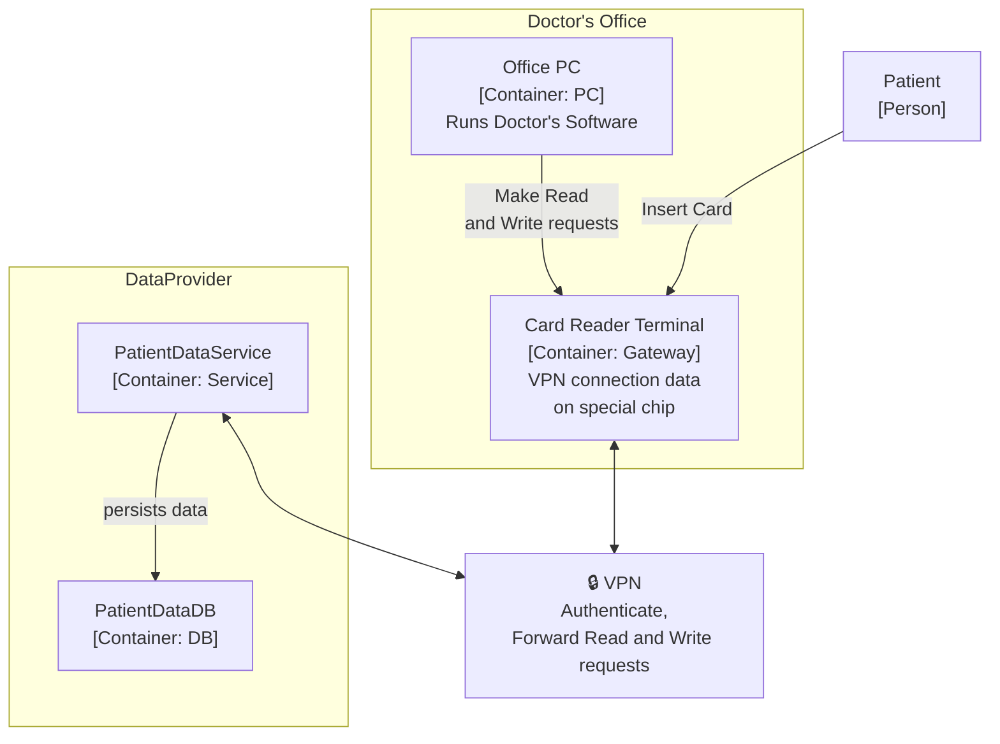

# Secure Software Engineering Exam – Scenario SePA

This scenario is inspired by the German _Elektronische Patientenakte_ (ePA, electronic patient files) but is neither dependent on nor directly related to it.

In this exam, you are tasked with developing the _Sichere elektronische Patienten Akte_-Software (SePA, Secure Electronic Patient Files) following the secure software development lifecycle steps. The diagram below shows the components of this system relevant to the exam tasks.

This document contains the preconditions, you can assume, an overview of the workflow and the further conditions of the system.

---

## Workflow Precondition

You can assume that each patient has already received an insurance card and that a corresponding patient file has been created in the _PatientDataDB_.

_(Note: This is not shown in the diagram because it occurs only once and is not directly part of the exam tasks.)_

---

## System Architecture

---

## Workflow Overview

### 1. Patient Arrival

When a patient arrives at the doctor's office, they present their insurance card. The card is inserted into a terminal connected to the doctor's PC. This authorizes the doctor to access the patient's data for 30 days.

### 2. Data Retrieval

The doctor uses their software to request the patient's data from the _PatientDataService_.

### 3. Data Update

At the end of the visit, the doctor updates the patient's information and sends these changes to the _PatientDataService_.

### 4. Data Persistence

The _PatientDataService_ then persists the updated data in the _PatientDataDB_.

---

## System Conditions

- **Patient Insurance Card**
  The card contains the patient's information (e.g., PatientID), a private key used to sign requests, and additional health information (e.g., allergies, blood type, organ donor status).

- **Doctor's Chip Card**
  The terminal also contains a chip card unique to each doctor, which establishes a secure connection to the SePA-VPN.

- **Secure Gateway**
  All requests from the doctor's software pass through the terminal, which acts as a secure gateway to the SePA-VPN.

- **Restricted Access**
  - The _PatientDataService_ is only accessible through the SePA-VPN.
  - The _PatientDataDB_ is only reachable by the _PatientDataService_ (i.e., not directly by clients).

---

## Points Overview

| Topic                          | Total Points |
| ------------------------------ | ------------ |
| Single statement questions 1–6 | 16           |
| Misuse/Abuse-Cases             | 7            |
| Threat Modeling/Analysis       | 22           |
| Protection Poker               | 8            |
| Defensive Coding               | 21           |
| Test Driven Development        | 3            |
| Insider Threats                | 12           |
