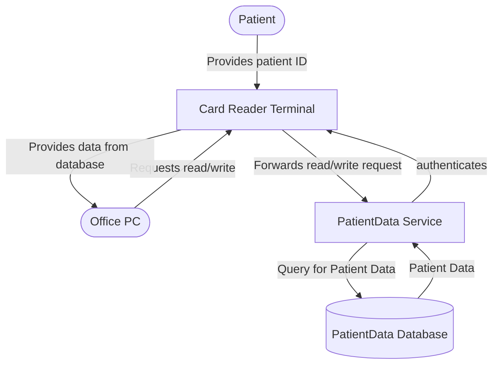

# Secure Software Engineering Exam – SSE 2425 WS 1

---

## Single Statement Questions

- What does the AAA principle stand for? Please name all three elements and describe them briefly.

- Please name one insecure cryptographic hash function and describe why it is considered broken.

- Please describe the concept of "Attack Surface" and what parameter can have an influence on it briefly.

- Imagine you are using an LLM as one component in your software. Please describe two security considerations briefly that you have to address in this scenario.

- Please name the problems in symmetric and public-key encryption that hybrid encryption is solving. Describe how hybrid encryption is doing that briefly.

- What are the differences between Risk Management and Vulnerability Assessment? Please name briefly when to use each and why.

---

## Misuse + Abuse Cases

- Please explain how:
  1. Misuse/abuse cases differ from standard use cases in software engineering.
  2. What roles Mis- and Abuse cases play in identifying and addressing potential security threats?

- Please describe two abuse cases for the scenario presented on the paper in front of you. In your answer, focus on typical real-world threats rather than highly specialized scenarios, and be sure to list any assumptions you make about the environment or users.

---

## Threat Modeling

- Please name the three phases of the general threat modeling approach. You don't need to describe them.

- The following figure shows a data flow diagram for the SePA application. Please write down all trust boundaries you would define in this scenario by naming them based on the advice in the lecture and describing the corresponding edge numbers. Also, provide your reasoning for them briefly.

  > E.g.: "Trust boundary 'Intergalactic interface' (Edges 10, 13, and 42): Since aliens can read our thoughts, ..."

### SePA Data Flow Diagram



- Based on the same figure, please conduct a **STRIDE per Element** analysis for the external entity "Patient" and name one threat for each element (if applicable).

  > E.g.:
  >
  > - **S:** Possible, because an attacker...
  > - **I:** Not possible, because we assume that...

---

## Protection Poker

Imagine that the SePA application should be extended with the following three features:

- **A:** A patient moves and needs to update their address.
- **B:** The medical data should be accessible to researchers in an anonymized way.
- **C:** Tracking the spread of viral infection should be possible by cross-referencing illness occurrences and addresses (by authorized research institutes).

The following assets are available:

1. Patient Name
2. Address
3. Phone number
4. Illness record
5. Past doctor visits
6. Open referrals to other doctors

> The Fibonacci Numbers up to 100 are: 1, 2, 3, 5, 8, 13, 21, 34, 55, and 89.

Your task is to conduct risk assessment using protection poker. Please fill out the missing fields in the following tables. While the header row (right of Patient Data) should be filled out, there may be fields you can leave blank.

### Assets Table

| Patient Data                    | _abcde_ | _abcde_ | Your additional comments |
| ------------------------------- | ------- | ------- | ------------------------ |
| Patient Name                    | abcde   | abcde   | abcde                    |
| Patient Address                 | abcde   | abcde   | abcde                    |
| Phone Number                    | abcde   | abcde   | abcde                    |
| Illness Records                 | abcde   | abcde   | abcde                    |
| Past doctor visits              | abcde   | abcde   | abcde                    |
| Open referrals to other doctors | abcde   | abcde   | abcde                    |
| _abcde_                         | abcde   | abcde   | abcde                    |
| _abcde_                         | abcde   | abcde   | abcde                    |
| _abcde_                         | abcde   | abcde   | abcde                    |

### Features Table

| Feature                            | _abcde_ | _abcde_ | _abcde_ |
| ---------------------------------- | ------- | ------- | ------- |
| A: Patient moves                   | abcde   | abcde   | abcde   |
| B: Anonymous access to researchers | abcde   | abcde   | abcde   |
| C: Viral infection spread tracking | abcde   | abcde   | abcde   |

- Based on your assessment: Which feature seems to have the highest risk? (A, B, or C?)

---

## Defensive Coding

- Present an argument for the following statement: "Complexity is the enemy of security."

- Please name and briefly describe two of the complexity types you've learned in the lecture that affect the system.

---

## Defensive Coding Principles in Practice (In total 4, here only 2)

The following Java code snippets may contain one or more coding mistakes that violate defensive coding guidelines. Your task is to:

- Identify the line with the mistake. _(1 Point)_
- State the issue briefly. _(1 Point)_
- Describe the mitigation briefly. _(2 Points)_

If there is no coding mistake in the snippet, state this and briefly explain why.

### Snippet 1 – Web Page Generator

```java
 1  // This function takes user input to generate a welcome web page
 2  public void generateWebpage(String input) {
 3      BufferedWriter bw = null;
 4      File f = new File(pagePath); // pagePath is defined outside this function and safe.
 5      try {
 6          FileWriter fw = new FileWriter(f);
 7          bw = new BufferedWriter(fw);
 8          bw.write("<html>");
 9          bw.write("<body>");
10          bw.write("<span>Your name is: ");
11          input = StringUtils.replace(input, "<script>", "");
12          bw.write(input);
13          bw.write("</span>");
14          bw.write("</body>");
15          bw.write("</html>");
16          bw.close();
17      } catch (IOException e) {
18          // [For the exam please think that error handling is done correctly here.]
19      }
20  }
```

### Snippet 2 – User Finder

```java
 1  // This function takes user input to look for a username in the database.
 2  public void findUser(String friendName) {
 3      Connection conn = DriverManager.getConnection("jdbc:mysql://localhost:3306/example_db",
         "root", "root_password1337");
 4      Statement stmt = conn.createStatement();
 5      String query = "SELECT * FROM Users WHERE username = '" + userInput + "'";
 6      ResultSet rs = stmt.executeQuery(query);
 7      while (rs.next()) {
 8          System.out.println("Found user: " + rs.getString("username"));
 9      }
10      rs.close();
11      stmt.close();
12      conn.close();
13  }
```

---

## Test Driven Development

Suppose you are tasked with implementing a FIFO (First in-First out) data structure on integers only, and you must use Test Driven Development. What are the first three tests (1 point each) you are implementing? Describe them briefly in words.

> E.g.: "Test 1: After method A is called with parameter X, I expect Y to be returned by method B."

A FIFO data structure has the following methods:

- `void push(int x)`
- `int pop()`
- `int size()`

---

## Insider Threats

Assume you are a full-stack (Frontend, Backend, Databases) developer working on the SePA software part that doctors use to interact with the Card Reader Terminal.

Please describe possible insider threats if:

**Case A:** Your goal is to gain an advantage for yourself.

**Case B:** Your goal is to do as much damage as possible.

- Briefly describe two insider threats for each case.
- Briefly describe one mitigation for an insider threat of Case A and one of Case B.
